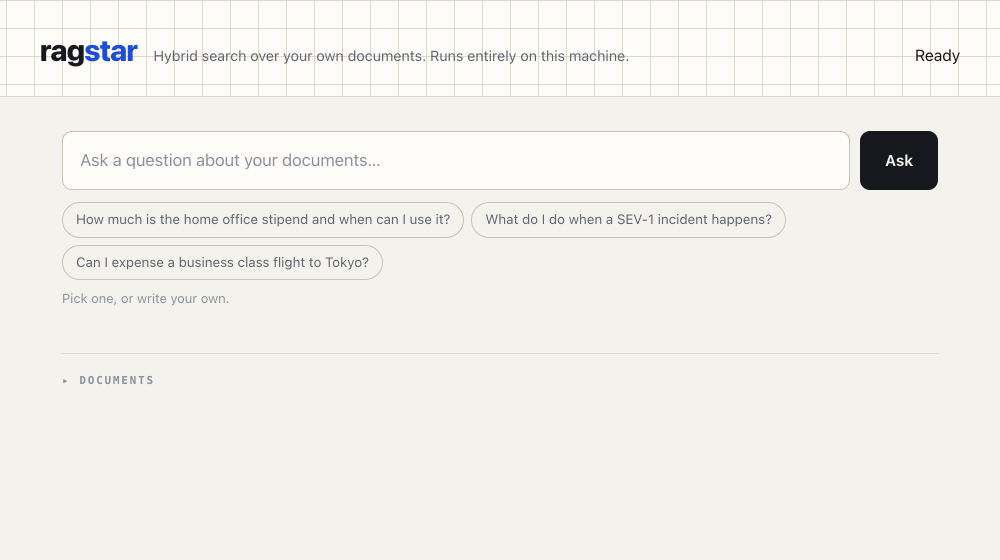
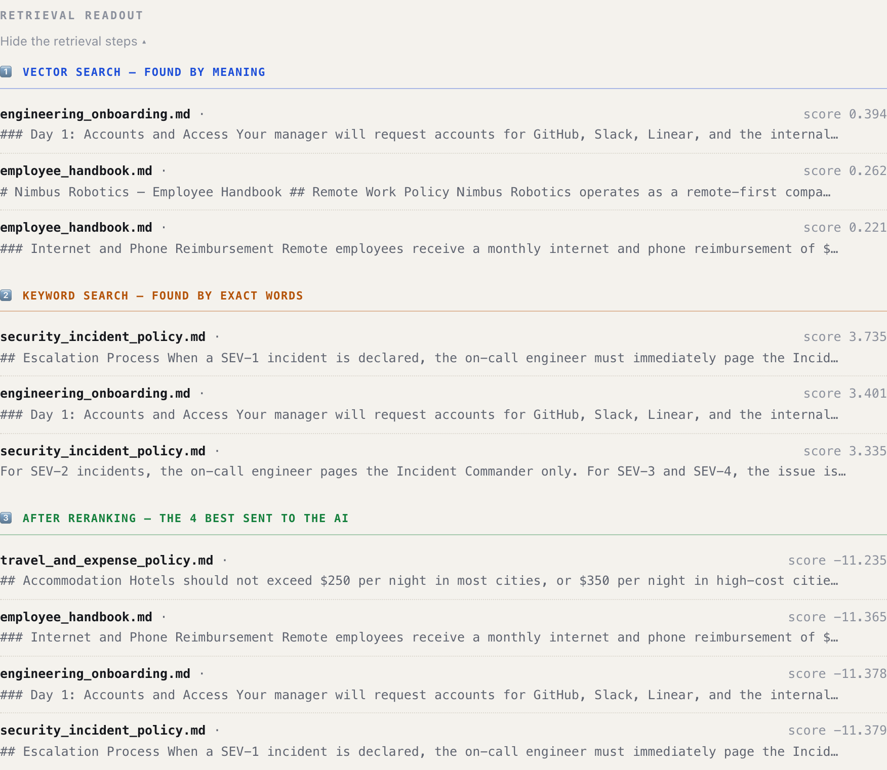

# ragstar — Hybrid Search RAG

**Ask questions about your own documents. Get answers with citations. Nothing leaves your machine.**

No API keys. No Pinecone. No OpenAI. Every model runs locally.

---

## 🚀 Quick start

```bash
python3 -m venv .venv
source .venv/bin/activate
pip install -r requirements.txt
ollama pull qwen3b-128k

python demo_app.py          # web UI  → http://localhost:8100
```

| Command | What it does | Takes |
|---|---|---|
| `python demo_app.py` | Web UI, streaming answers | ~10s to start |
| `python local_rag.py` | 5 demo questions in the terminal | ~1 min |
| `python local_rag.py --eval` | Full eval: 10 questions + metrics | ~3 min |
| `python test_rrf.py` | 7 unit tests (no models needed) | <1s |

---

## 📸 What it looks like

**Asking.** Asking is the primary action, so it sits at the top and carries the most weight. Loading documents is setup, and collapses out of the way below.



**Refusing.** Asked something the documents don't cover, it says so rather than inventing an answer — and the card turns **red**, because a refusal is a different outcome, not a short answer. No LLM call is made at all.


**The retrieval readout.** Every stage, with its scores. Each stage owns a colour, so you can tell at a glance which retriever surfaced a row: **blue** = vector search (meaning), **amber** = BM25 (exact words), **green** = what survived reranking. Scores are right-aligned in a monospace column, because rank reads far easier down a straight edge.

Note the reranker scores of about **−11** here — that is precisely why the question above was refused. The floor is −6.0.



> Shots are the light theme. The interface is built for both — `prefers-color-scheme` is honoured, and so is `prefers-reduced-motion`.

---

## 🧠 The 60-second mental model

**The problem:** An LLM doesn't know your company docs. If you ask anyway, it invents an answer.

**The fix:** Find the right pages first. Then make the LLM answer *only* from those pages.

That's it. Everything else is detail.

**Two jobs, and they are completely separate:**

| Job | Question it answers | Where it lives |
|---|---|---|
| 🔍 **Retrieval** | "Which paragraphs are relevant?" | `local_rag.py` stages 0–4 |
| ✍️ **Generation** | "What's the answer, using only those?" | `local_rag.py` stage 5 |

> ⚠️ **Remember this:** Retrieval can be perfect and the answer still wrong. They fail independently. Most of the guards in this project exist because of that split.

---

## 📁 What's in this folder

```
hybrid-rag/
│
├── local_rag.py      ⭐ THE BRAIN — all 6 stages, every setting    (523 lines)
├── demo_app.py       🖥️  THE FACE — web server + browser UI       (1091 lines)
│
├── rrf.py            🔀 Merges 2 ranked lists into 1                (47 lines)
├── faithfulness.py   ⚖️  Grades answers for hallucination          (151 lines)
├── eval_rag.py       📊 Scores the system on 10 known questions    (232 lines)
├── test_rrf.py       ✅ 7 unit tests, no models required           (258 lines)
│
├── demo_docs/        📄 4 fake company docs → 23 chunks
├── assets/           🖼️  README screenshots
└── requirements.txt  📦 8 dependencies
```

### File-by-file: what each one actually does

| File | Its one job | Open it when… |
|---|---|---|
| **`local_rag.py`** | The whole pipeline + every tunable number | you want to change behaviour |
| **`demo_app.py`** | FastAPI server, HTML/CSS/JS, 8 endpoints | you want to change the UI |
| **`rrf.py`** | One function: `reciprocal_rank_fusion()` | you want to understand merging |
| **`faithfulness.py`** | Second LLM call that grades the first | you care about hallucination |
| **`eval_rag.py`** | Golden dataset + hit-rate/MRR scoring | you want to measure quality |
| **`test_rrf.py`** | Fast tests using fake clients | you changed anything |

> 💡 **Why so few files?** This used to have a second, parallel cloud version (Pinecone + Cohere) — 11 files that nothing imported and that needed API keys. Deleted. **One working path beats two half-paths.**

---

## 🗺️ Architecture map

```
        YOU TYPE A QUESTION
                │
                ▼
   ╔═════════════════════════╗
   ║  STAGE 0  Rewrite       ║  fix typos, expand "PTO"
   ║  STAGE 0b Split  (OFF)  ║  multi-part questions
   ╚═════════════════════════╝
                │
                ▼
   ╔═════════════════════════╗
   ║  STAGE 2  Find          ║
   ║  ┌─────────┬──────────┐ ║
   ║  │ Vector  │  BM25    │ ║  meaning  ‖  exact words
   ║  │ search  │  search  │ ║
   ║  └────┬────┴────┬─────┘ ║
   ║       └────┬────┘       ║
   ║      STAGE 3  RRF       ║  merge the two lists
   ╚═════════════════════════╝
                │  10 candidates
                ▼
   ╔═════════════════════════╗
   ║  STAGE 4  Rerank        ║  score each one properly
   ╚═════════════════════════╝
                │  best 4
                ▼
        ┌───────────────┐
        │  🚦 GATE      │  best score < -6.0 ?
        └───────┬───────┘
           yes  │  no
        ┌───────┴────────┐
        ▼                ▼
   "I could not    ╔══════════════╗
    find that"     ║ STAGE 5 Write║  stream the answer
    (no LLM call)  ╚══════════════╝
                          │
                          ▼
                   ANSWER + [Source N]
```

**Stage 1 is missing from that diagram on purpose** — it's **Ingestion**, and it runs once at startup, not per question.

```
demo_docs/*.md  →  split into 500-char chunks  →  23 chunks
                                                    │
                                    ┌───────────────┴──────────────┐
                                    ▼                              ▼
                            embed each chunk               BM25 word index
                            (NumPy matrix)                 (rank_bm25)
```

---

## 🔬 Every stage, and WHY

### Stage 1 — Ingestion (once, at startup)

- Read every `.md` in `demo_docs/`
- Cut into **500-character chunks**, each overlapping the last by **50 chars**
- Embed each chunk → a 384-number vector
- Also build a BM25 word index over the same chunks

**Why chunk at all?** You can't paste 4 documents into a prompt — context windows are finite, and burying the answer in noise makes the model worse.

**Why 500?** Small enough to pinpoint one fact. Big enough to keep a complete thought.

**Why 50 overlap?** A sentence sitting exactly on a cut line would be split in half and lost by both chunks. The overlap guarantees it survives whole in at least one.

---

### Stage 0 — Rewrite the question ✅ ON

One small LLM call cleans the question **before** searching.

| You type | Searched as |
|---|---|
| `wat is teh home ofice stipend` | `What is the home office stipend?` |
| `PTO` | `Paid Time Off` |
| `PTO policy` | `Paid Time Off Policy` ← **miss → hit** |

**Why it matters:** BM25 matches *literal words*. Your documents never contain the letters "PTO" — they say "paid time off". Without rewriting, that question found **nothing**.

**Two deliberate choices:**
- 🔍 Search uses the **rewritten** question → better matching
- ✍️ The answer addresses your **original** question → replies to what you asked

**Safety:** blank reply, rambling reply, or Ollama down → **use the original**. A bad rewrite can never be worse than no rewrite.

---

### Stage 0b — Split multi-part questions ❌ OFF

Splits *"What is the stipend **and** how long is parental leave?"* into two questions, searches each, pools the results.

**It works. It's tested. It's off. Here's why —**

I measured it on 2-part and 3-part questions spanning three different documents:

| Question | Decomposition wins |
|---|---|
| hotel limit / parental leave / data breach | **0** |
| PR review / learning budget / deploy freeze | **0** |

Every needed fact already reached the LLM **without** splitting.

**Why zero?** This corpus has **23 chunks** and each search returns **10 candidates** — one search already sweeps **~43% of everything that exists**. There is nothing left for a split to find.

**When to turn it on:** when your corpus is big enough that 10 candidates is a *thin slice*. That's exactly when a two-topic question produces one embedding that lands between both topics and matches neither.

> 🎓 **The lesson:** a feature that costs 2–6 seconds per query and wins 0 times should not be on. **Measure, don't assume.** Flip `USE_DECOMPOSITION = True` and re-measure on your own data.

---

### Stage 2 — Two searches at once

| Search | Finds | Blind to |
|---|---|---|
| 🧭 **Vector** (meaning) | "stipend" ≈ "allowance" ≈ "reimbursement" | exact codes, IDs |
| 🔤 **BM25** (exact words) | "SEV-1", "$1,500", "90 days" | synonyms |

**Why both?** They fail in *opposite* ways. Vector search misses "SEV-1" because it's a rare token with little meaning. BM25 misses "how much do I get for my desk" because those words appear nowhere.

**Two independent opinions beat one confident one.**

---

### Stage 3 — RRF (merging the two lists)

**The problem:** vector scores run 0→1. BM25 scores run 0→30+. They are different units. Comparing them directly is meaningless — like adding kilograms to kilometres.

**The fix:** throw the scores away. Use only **rank position**.

```
score = 1 / (60 + rank)
```

- Rank 1 → 0.0164
- Rank 2 → 0.0161
- Rank 3 → 0.0159

Appear in **both** lists? Your two scores **add up**.

> 💡 **The insight:** "both methods independently rated this highly" is a much stronger signal than either score alone.

**Why 60?** It's the value from the original RRF paper. It flattens the gap between rank 1 and rank 2, so one retriever being slightly over-confident can't dominate the merge.

📄 Cormack et al., 2009 — [Reciprocal Rank Fusion outperforms Condorcet](https://plg.uwaterloo.ca/~gvcormac/cormacksigir09-rrf.pdf)

---

### Stage 4 — Rerank

A **cross-encoder** re-reads the question and each candidate **together**, then scores relevance properly.

**Why not use this for everything?** It's slow — it must run once per candidate. Fine for 10. Impossible for 10 million.

> 🏭 **The production pattern:** *retrieve cheaply over everything → rerank expensively over the few.*

10 candidates in → **4 best** out.

---

### 🚦 The Gate — refuse when retrieval is weak

Before the LLM sees anything: **if the best chunk scores below −6.0, stop.** Return *"I could not find that in the documents."*

**Why guard this in code?** Handing a model irrelevant context and asking nicely for honesty is how hallucinations happen. This is a plain Python `if` — it *cannot* be talked out of it.

### ❓ "Why −6.0? Why not another number?"

**Because I measured it.** I ran real questions and looked at actual scores:

| Question | Top score | |
|---|---|---|
| Home office stipend | **+8.9** | ✅ answer |
| PR review time | **+8.5** | ✅ answer |
| Business class flight | **−1.1** | ✅ answer |
| ⬇️ **big empty gap — nothing scores here** ⬇️ | | |
| Tokyo wifi password | **−11.2** | ❌ refuse |
| 2018 World Cup | **−11.0** | ❌ refuse |
| Company stock ticker | **−11.1** | ❌ refuse |

- Real questions: **−1.1 and above**
- Unanswerable: **all around −11**
- Nothing lands in between → **put the line in the middle of the empty gap**
- −6.0 gives ~5 points of safety margin on **both** sides

> 🪤 **The trap I nearly fell into:** the obvious threshold is **0** — negatives look "bad". But *"Can I expense a business class flight?"* scores **−1.1** and the docs **do** answer it. A threshold of 0 would silently break a working feature.
>
> **A number that looks sensible is not the same as a number that is correct. Measure.**

⚠️ This threshold is **specific to this corpus and this rerank model**. Different documents → re-measure it.

---

### Stage 5 — Write the answer

- Prompt says: *answer using only these sources, cite them as `[Source N]`*
- **`temperature=0`** — deterministic
- Streams out word by word

**Why temperature 0?** Temperature = randomness. For creative writing you want some. For *"how much is the stipend"* you want the **same correct answer every time**. Non-zero temperature made it wander and claim it couldn't find facts that were sitting right there in the context.

---

## ⚙️ Every setting, and why that value

All in `local_rag.py`, lines 32–99.

| Setting | Value | Why this value |
|---|---|---|
| `CHUNK_SIZE` | 500 | Small = precise. Big = keeps context. 500 balances both. |
| `CHUNK_OVERLAP` | 50 | Saves sentences that land on a cut line. |
| `TOP_K_HYBRID` | 10 | Enough for rerank to have real choice; cheap enough to be fast. |
| `TOP_K_RERANK` | 4 | What reaches the LLM. More = noise buries the answer. |
| `REFUSE_BELOW_RERANK` | **−6.0** | **Measured.** Sits in the empty gap between −1.1 and −11. |
| `CACHE_SIZE` | 256 | Covers any session; costs a few KB. |
| `REWRITE_MAX_GROWTH` | 3 | A rewrite 3× longer = the model started explaining itself. |
| `REWRITE_MAX_CHARS` | 120 | **Absolute floor.** Short queries *must* be allowed to grow. |
| `MAX_SUBQUESTIONS` | 3 | Beyond 3, the model invents questions you didn't ask. |
| `USE_RERANK` | `True` | Tested off — the right chunk fell out of the top 4. Keep on. |
| `USE_QUERY_REWRITE` | `True` | Turned "PTO policy" from miss into hit. |
| `USE_DECOMPOSITION` | `False` | **Measured 0 wins** on this corpus. Costs 2–6s. |

### ❓ "Why does `REWRITE_MAX_CHARS` exist?"

Because a bug taught me it had to.

- Guard was originally **only** "reject if 3× longer than the original"
- `"PTO"` (3 chars) → `"Paid Time Off"` (13 chars) = **4.3× growth**
- **Rejected.** The single best rewrite in the whole system — thrown away

Expanding an abbreviation makes short text *much* longer. That's the **point**, not a failure. So the rule became: allow **3× OR 120 characters, whichever is larger**. A genuinely rambling answer runs to paragraphs and still gets caught.

> 🎓 A guard that blocks the thing your feature exists to do is worse than no guard.

---

## ⚡ Performance: what the cache does

`@lru_cache` on the two expensive per-question steps. Ask the same thing twice:

| Step | First time | Second time | Speedup |
|---|---|---|---|
| Rewrite query | 5953 ms | **0.01 ms** | ~486,000× |
| Embed query | 2752 ms | **0.24 ms** | ~11,500× |

**Why is caching safe here?** Both depend **only on the question text** — never on your documents. Re-ingest all you like; the cache stays correct. And at `temperature=0` the rewrite is deterministic, so a cached value is *exactly* what a fresh call would return.

**Why cache the rewrite and not the final answer?** The rewrite is a pure function of the question. The answer depends on your documents — cache that and editing a file would serve stale answers.

---

## 🌊 Streaming: same speed, feels faster

Before: blank box for 6 seconds, then everything at once.

| Time | What you see |
|---|---|
| **1.66s** | Retrieval stages appear |
| **3.64s** | First words of the answer |
| **6.35s** | Done — 54 pieces streamed |

Identical total time. Completely different to sit through. The stages don't wait for the LLM at all — they're ready before it starts, so they're sent first.

---

## 📄 Citations you can actually check

- Every source the model read is shown **in full** under the answer
- Every `[Source N]` in the answer is **clickable** → jumps to that passage and flashes it

**The subtle part:** the model isn't shown every reranked chunk — a weak 4th gets dropped. So `[Source 2]` means *"the 2nd chunk the model was shown"*, **not** *"the 2nd reranked chunk"*.

Both the prompt and the UI read from one function, `_prompt_sources()`, so they can never disagree. Get this wrong and the feature actively lies to you — pointing at the wrong paragraph is worse than showing none.

---

## 🧪 Tests

```bash
python test_rrf.py        # 7 tests, <1 second, no models, no Ollama
```

| Test | Proves |
|---|---|
| `test_rrf_merge` | Both-list agreement outranks single-list |
| `test_single_origin` | One-retriever hits still score |
| `test_no_overlap` | Disjoint results both survive |
| `test_refuses_when_retrieval_is_weak` | Weak scores refuse **without** the LLM |
| `test_query_rewrite_falls_back_safely` | 6 bad-rewrite paths → original kept |
| `test_cache_skips_repeat_work` | Same question = **1** LLM call, not 2 |
| `test_decompose_query_guards` | Off by default; bad splits rejected |

**Why fake clients instead of the real model?** Tests you won't run are worthless. These run in **milliseconds**, so they run every time.

---

## 📊 Results

**Retrieval** (`python local_rag.py --eval`):

```
Hit-rate@5:  100.0%  (10/10)
MRR@5:        1.000

Easy 4/4 · Medium 3/3 · Hard 3/3
```

- **Hit-rate** = was the right chunk found at all?
- **MRR** = 1.000 means it was always ranked **#1**, not merely present

**Faithfulness** (LLM-as-Judge, first 5 questions):

```
Faithfulness rate:  100%  (5/5)
Average score:      1.00
```

Every cited claim in all 5 answers is supported by the source it points at.

### ❓ "How do you know that 100% is real?"

**Because the broken version also said 100%.**

`faithfulness.py` had a bug: `.format()` was called with `answer=` and `sources=`, but the prompt template had **no `{answer}` or `{sources}` slots**. Python's `.format()` **ignores extra keyword arguments without erroring**, so both were silently thrown away. The judge was grading with neither the answer nor the sources in front of it — and echoed the `1.0` from its own examples every time.

So a passing score proves nothing on its own. **A grader that can only say "pass" is indistinguishable from a broken one.** Before trusting the number above, the judge was fed answers it *should* reject:

| Test answer | Judge said | |
|---|---|---|
| Correct: "stipend is $1,500, first 90 days" | **1.00 pass** | ✅ |
| Invented: "stipend is **$5,000** and never expires" | **0.00 fail** | ✅ caught |
| Contradicts source: "business class, **no approval** needed" | **0.00 fail** | ✅ caught |
| Fake citation: cites **[Source 7]** (only 3 exist) | **0.00 fail** | ✅ caught |

It failed all three bad answers and **named the offending claim** each time. It can say "no" — so its "yes" is worth something.

> 🎓 **The lesson:** a metric that silently measures nothing is worse than no metric — it buys false confidence. **Always prove your test can fail before you believe it passes.**

---

## 💥 What can go wrong

| Symptom | Likely cause | Fix |
|---|---|---|
| Refuses everything | Threshold wrong for your docs | Re-measure, adjust `REFUSE_BELOW_RERANK` |
| Answers nonsense confidently | Weak chunks reaching the LLM | Raise the threshold |
| Can't find obvious things | Question wording ≠ document wording | Rewriting helps; check chunk size |
| Server won't start | Port 8100 busy | `lsof -ti tcp:8100` |
| Blank page, buttons dead | JS error | Browser console; check Python `\n` escapes in embedded JS |
| Very slow first query | Models loading | Normal — subsequent queries are cached |

---

## 🔧 Tech stack

| Job | Tool | Runs on |
|---|---|---|
| Embeddings | `all-MiniLM-L6-v2` | your CPU |
| Vector index | NumPy matrix | your RAM |
| Keyword index | `rank_bm25` | your RAM |
| Reranker | `ms-marco-MiniLM-L-6-v2` | your CPU |
| LLM | Ollama `qwen3b-128k` | your machine |
| Web | FastAPI + vanilla JS | localhost |

**Zero API keys. Zero cloud. Zero cost per query.**

> On the model choice: `qwen2.5:0.5b` was tested for speed. It was too weak — it said *"I could not find that"* for questions whose answer was sitting in the retrieved context. Retrieval was fine; the model just couldn't read it. `qwen3b` is the smallest one that answers reliably here.

---

## 🎓 The five lessons this codebase taught

1. **Measure, don't assume.** −6.0 came from data. 0 "looked right" and would have broken a working feature.
2. **A guard can block the thing you're building.** The 3× rule rejected the best rewrite in the system.
3. **A broken metric is worse than no metric.** The faithfulness judge reported 100% while reading nothing — and a passing score looks identical either way. **Prove a test can fail before believing it passes.**
4. **Retrieval quality ≠ answer quality.** They fail separately. Guard them separately.
5. **Ship the feature, then check if it earns its place.** Decomposition works perfectly and is off, because it won 0 times.
